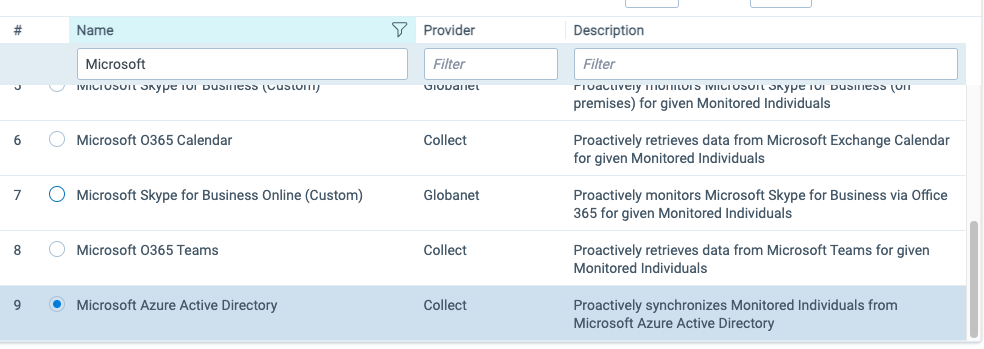
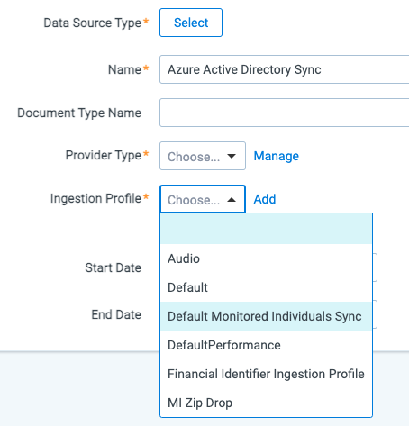
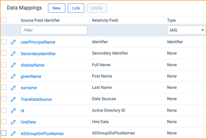

# Microsoft Azure Active Directory
{: .no_toc }

Sync Monitored Individuals with Microsoft Azure Active Directory.
{: .fs-6 .fw-300 }

1. TOC
{:toc}

---

## Requirements

### License requirements

The following licenses are required to use this data source:
1. Microsoft 365 E3 or higher is required.
2. If you are using Microsoft 365 E3, you also need to add the Compliance module.

### Versions supported

We support Microsoft 365 Enterprise 3 and above.

## Considerations

All data sources in a workspace can be run either as fully automated or fully manually; not both simultaneously.

## Setup instructions

This section provides details on the prerequisites and steps for setting up this data source.

### Prerequisites

You must have the following in order to complete the setup instructions for this data source.

#### Standard prerequisites

You must have Collect installed in the workspace to set up this data source, since Collect will be used for data retrieval. 

For details on installing Collect, see [Using Relativity Collect]({{ site.baseurl }}).

#### Company specific prerequisites

You must have the following company-provided information to complete the authentication steps that precede setting up the data source:
1. Access to the Azure portal and an active account.
2. O365 Administrator rights.

### Authentication

Before configuring the data source complete the following authentication and configuration steps.

#### Configuring Users and Groups in Azure Portal and O365 Admin Center

Monitored Individual Auto Sync will sync only employees (Users):
- From given Groups.
- Who have valid O365 License assigned.
- Have “Access enabled”.

To configure an employee (User) to sync with Trace, you must have access to Azure Portal and O365 Portal with O365 Administrator rights.
{: .info}

#### Configure Users in O365

Follow the steps below to configure Users in O365:
1. Sign into **O365 Portal**.
2. Navigate to **Admin** > **Active Users** and verify the employee is assigned to the O365 License.
3. If needed, to assign an employee (User) to the License, go to **User details** > **Licenses and apps**, select the appropriate **License**, and click **Save**. Otherwise, skip this step.

#### Configure Users and Groups in Azure

Follow the steps below to configure Users and Groups in Azure:
1. Sign into **Azure Portal**.
2. Navigate to **Azure Active Directory** > **Users**.
3. Make sure all monitored employees (Users) have **Account enabled** field set to **Yes**.
4. If you need to modify an employee’s (User) account, go to **User details**, click **Edit** and change **Block sign in** to **Yes** (access enabled) if it is set to **No** (access disabled).
5. Navigate to **Azure Active Directory** > **Groups**.
6. Create one or more Groups which will represent the mapping between employees (Users) and Trace Data Sources. Note the following:
   - Group Type must be set to **Microsoft 365**.
   - If there is only one Data Source, then only one Group is needed.
   - For multiple Data Sources, if all employees are linked to all Data Sources, then only one Group is needed.
   - One Group can be linked to one or more Data Sources.
   - One employee (User) can be linked to one or more Groups.

To create a new Group, navigate to **Azure Active Directory** > **Groups,** click **New Group,** enter a name, enter **Microsoft 365**, and save.
{}: .info}

7. To assign employees (Users) to a Group, navigate to **Azure Active Directory > Groups**, go to **Group** **details**, go to **Members**, click **Add Members** and select employees.
8. For each Group, capture the **Group identifier (Object Id)**. It will be needed to create mapping of Azure Active Directory Group identifier towards Data Sources.

#### Map Azure Active Directory Group identifier to Trace Data Source with JSON

Create a JSON config file that will be used to map the Azure Active Directory Group identifier (Object Id) to the Data Source.

```json
[ 
    { 
        "GroupId": "xxx", 
        "DataSourceName": "xxx" 
    }, 
    { 
        "GroupId": "xxx", 
        "DataSourceName": "xxx" 
    }, 
    { 
        "GroupId": "xxx", 
        "DataSourceName": "xxx" 
    } 
]
```

- **GroupID**: Group identifier (**Object Id**) captured from Azure Portal.
- **DataSourceName**: name of Trace Data Source that will be created in Relativity Trace.


*Examples*

**Example 1 – Using only one Data Source:**

Azure Active Directory Users from “9ccf…” group will be linked to “Collect O365 Mail” Data Source.

```json
[ 
    { 
        "GroupId": "9ccf034a-d46e-4a04-b730-1f2bd8399aa7", 
        "DataSourceName": "Collect O365 Mail" 
    } 
] 
```

**Example 2 – Using multiple Data Sources:**

Users from “9ccf…” group will be linked to “Collect O365 Mail,” “Collect O365 Calendar,” and other Data Sources.

```json
[ 
    { 
        "GroupId": "9ccf034a-d46e-4a04-b730-1f2bd8399aa7", 
        "DataSourceName": "Collect O365 Mail" 
    }, 
    { 
        "GroupId": "9ccf034a-d46e-4a04-b730-1f2bd8399aa7", 
        "DataSourceName": "Collect O365 Calendar" 
    }, 
    { 
        "GroupId": "9ccf034a-d46e-4a04-b730-1f2bd8399aa7", 
        "DataSourceName": "Collect O365 Teams" 
    }, 
    { 
        "GroupId": "9ccf034a-d46e-4a04-b730-1f2bd8399aa7", 
        "DataSourceName": "Collect Slack Enterprise" 
    }, 
    { 
        "GroupId": "9ccf034a-d46e-4a04-b730-1f2bd8399aa7", 
        "DataSourceName": "Audio" 
    } 
]
```

**Example 3 – Populate “Restricted” and “Non-Restricted” group info:**

Users from “9ccf…” group will be linked to “Collect O365 Mail” and “Collect O365 Teams” Data Sources.

Additionally, indication if a user belongs to “Restricted” (13be) or “Non-Restricted” (b324) group will be populated. This requires changes to: Monitored Individual, Data Mapping, and Ingestion Profile. See further instructions.

```json
[ 
    { 
        "GroupId": "9ccf034a-d46e-4a04-b730-1f2bd8399aa7", 
        "DataSourceName": "Collect O365 Mail" 
    }, 
    { 
        "GroupId": "9ccf034a-d46e-4a04-b730-1f2bd8399aa7", 
        "DataSourceName": "Collect O365 Teams" 
    }, 
    { 
        "GroupId": "13bef1a4-d134-45a6-93cf-8ca130b805b4", 
        "DataSourceName": "Collect O365 Mail" 
    }, 
    { 
        "GroupId": "13bef1a4-d134-45a6-93cf-8ca130b805b4", 
        "DataSourceName": "Collect O365 Teams" 
    }, 
    { 
        "GroupId": "b3241d72-60ab-466b-be36-1217f8301095", 
        "DataSourceName": "Collect O365 Mail" 
    }, 
    { 
        "GroupId": "b3241d72-60ab-466b-be36-1217f8301095", 
        "DataSourceName": "Collect O365 Teams" 
    } 
] 
```

#### Register Azure App with specific permissions

We strongly recommend registering a separate Azure Application for each Data Source.
{: .warn }

To register your app:
1. Open your [Azure Portal](https://portal.azure.com/). 
2. Click **More Services**. 
3. Search for and select **Azure Active Directory**. 
4. In the left-navigation menu, click **App registrations**. 
5. Click **New Registration**. This will open the Register an application page. 
6. Enter an application name in the **Name** field. 
7. Select **Accounts** in this organizational directory only as the supported account type. 
8. Enter the redirect URL, http://localhost/ or https://localhost/, as the sign-on URL. 
9. Click **Register**. For more information on registering an application in Azure, see [Microsoft's documentation](https://docs.microsoft.com/en-us/azure/active-directory/develop/quickstart-register-app). 

From the app's page, add permissions to the web API: 
1. Click **API Permissions**. 
2. Click **Add a permission**. 
3. Click **Microsoft Graph**. 
4. Select **Application Permissions**. 
5. Select the following options from the **Application Permissions** section: 
   - **Group** - Read.All
   - **User** - Read.All
6. Click **Add permissions**. 
7. Click **Grant Permission**. 

Grant Admin consent for the API: 
1. Click the **API Permissions** tab. 
2. Click **Grant admin consent** for [tenant]. 
3. In the pop-up window, click **Accept**. If you do not have the ability to grant Admin consent for application permissions, you will need to find an Admin that can consent. 
4. Once clicked, the window will show all permissions granted. 
5. Verify all permissions have been granted. 
6. Click **Accept** to grant the permissions. 

Generate Client Secret:
1. In the left navigation menu, select **Certificates & secrets**. 
2. Select **New client secret**.
3. Enter a description in the **Description** text box. 
4. Set the expiration time frame to **Never**. 
5. Click **Add**. 
6. Click on the clipboard and copy secret to clipboard to paste in your text document. Save this secret, as you will need it to set up your data sources in Trace. 

Microsoft will only show this secret this one time; there is no way to recover a secret if it is forgotten or lost. Make a note of the Application ID that Microsoft assigned to the app registration. This ID is also required for setup of data sources in Trace.
{: .info }

You will need the following information to complete setup of the data source from the Trace front end: 
1. Application ID 
2. Client Secret (copy the **Value** field) 
3. Domain (mycompanydomain.com)

Make sure you copy the **Value** field item for your Client Secret. Do not accidentally copy the Secret ID item as this is not the your Client Secret.
{: .warn }

### Setup in Trace

#### Data Transformation

Create a new Data Transformation, make sure the following parameters are set as shown below.
1. **Name**: Enter **MI Sync**.
2. **Transformation Type**: Select **Monitored Individual Sync**.
3. **Content**: leave this field blank.
4. **Associated Data Source**: leave it not selected.
5. **Group Id To Data Source Name Mapping Json**: Copy the JSON config file created in the [Map Azure Active Directory Group identifier to Trace Data Source with JSON](#Map-Azure-Active-Directory-Group-identifier-to-Trace-Data-Source-with-JSON) section above.

```json
[ 
    { 
        "GroupId": "9ccf034a-d46e-4a04-b730-1f2bd8399aa7", 
        "DataSourceName": "Collect O365 Mail" 
    }, 
    { 
        "GroupId": "9ccf034a-d46e-4a04-b730-1f2bd8399aa7", 
        "DataSourceName": "Collect O365 Teams" 
    }
] 
```

6. **Secondary Identifier User Fields Json**: leave the default value.
7. Save.

#### Data Source

Most parameters work the same for all Collect Data Sources. Follow the instructions from [common_collect_data_source_functionality]({{ site.baseurl }}) section.

**Below are Azure AD Directory specific parameters:**

In the **General** section:
1. Select **Microsoft Azure Active Directory** for the **Data Source Type**.



2. **Provider Type:** Choose **System**.
3. **Ingestion Profile:** select Default Monitored Individuals Sync.
4. **Start Date:** Leave it empty.
5. **End Date:** Leave it empty.



In **Settings** section:
1. **Username:** Leave it empty. 
2. **Password:** Leave it empty.
3. **Application Secret**: The Client Secret provided by the client (see [Register Azure App with specific permissions)](#Register-Azure-App-with-specific-permissions) for more details).
4. **PGP Key:** Leave it empty..
5. **Passphrase:** Leave it empty.
6. **Application Token:** Leave it empty.
7. **Domain**: The O365 domain name provided by the client.
8. **Application Id**: Application (client) ID provided by the client.
**Application (client) ID** it not the same as **Directory (tenant) ID**.
{: .warn }

In **Advanced Configuraiton** section:
1. **Frequency in Minutes:** 1440.
This parameter controls how freqent Active Directory changes will be synchronized with Monitored Individual object in Trace.
{: .info}
2. **Pull Disabled Users:** Disabled by default. Enable if customer is aware of the risk of pulling disabled users for some use case.
3. **Pull Unlicensed Users:** Disabled by default. Enable to be able to pull shared mailboxes. To double check with customer if in given groups there are no other unlicensed accounts other than shared accounts.
4. **Active Directory User Fields Json:** leave default values.
5. Save.

In **Data Transformation** section:
1. Link **Monitored Individual Sync** Data Transformation that was created in previous step.

In **DATA SOURCE CONSOLE** section press **Enable Data Source**.

#### Synchronize custom employee data

It is possible to synchronize more employee data from Azure Active Directory. To configure that, Monitored Individual object and the default Ingestion Profile needs to be extended by additional fields and corresponding Data Mappings. [Here](https://docs.microsoft.com/en-us/graph/api/resources/user?view=graph-rest-1.0#properties) is a list of all supported fields.

Custom attributes are also supported in the form of: extension_APPID_attributeName, where APPID is the application ID (without hypens) of the app registration storing custom attributes with the name that can be searched by using the following pattern: “*-extensions-app. Do not modify*”. More info here: [custom attributes.](https://docs.microsoft.com/en-us/azure/active-directory-b2c/user-flow-custom-attributes?pivots=b2c-user-flow)
{: .info}

To synchronize custom employee data:
1. Create a new field on Monitored Individual object.
2. Create a new Data Mapping that points to newly created Monitor Individual field.
3. Link the Data Mapping with **Default Monitored Individuals Sync** Ingestion Profile.
4. On Data Source, modify **Active Directory User Fields Json** to contain this Data Mapping.

Do not modify default Data Mappings: **userPrincipalName**, **SecondaryIdentifier**, **displayName**, **givenName**, surname and **TraceDataSource**.
{: .warn}

In the example below, Monitored Invidual object is synchronized with the following custom fields:
- **Id**: additional Azure Active Directory field.
- **hireDate**: additional Azure Active Directory field.
- **ADGroupIDsPlusNames**: user Groups.

And the Ingestion Profile contain obligatory and custom Data Mappings:

